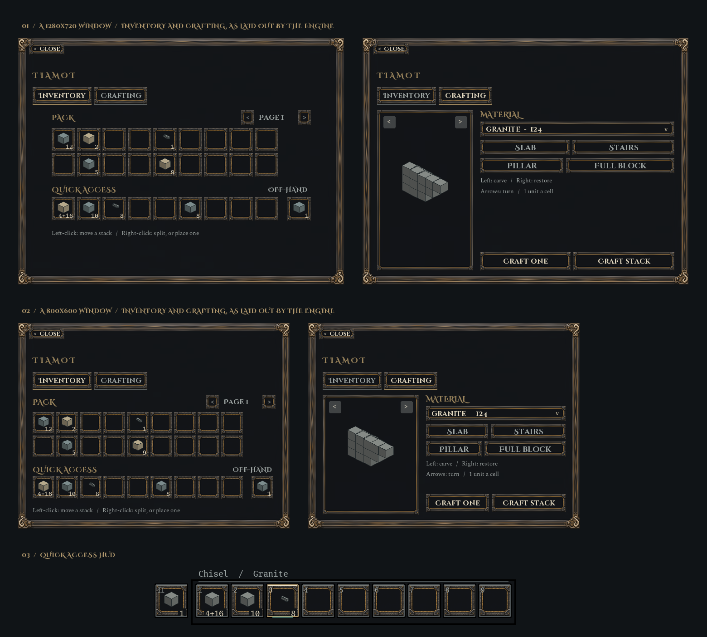

# Tiamot Default UI

The inventory screen, the shape crafter and the hotbar for the
[Tiamot](https://github.com/IridesiumResearch/Tiamot-Voxel-Game) voxel engine:
dark iron frames with brass edges, a paged pack, and a crafter that carves loose
material into slabs, stairs, pillars or any shape you chisel. It replaces the
engine's reference `core_ui`, so run one or the other.

It is also the look of the engine's own screens: `mod.toml` declares a
`[theme]`, so the pause screen, the settings pages, the start screen before a
world is joined and every mod's dialog wear the same ornate frame, iron
buttons, Cinzel and palette.

Other mods build on it. Life can put its wardrobe on a tab, World can add a
button, and anything else can do the same through this mod's exports, without
drawing a second screen of its own. See [For other mods](#for-other-mods).

Written against the engine's public Lua API and nothing else. The rules that
shape it are in [`AGENTS.md`](AGENTS.md) (vendored from the engine's `api/`), and
[`stubs/game.lua`](stubs/game.lua) is the API itself.



`docs/preview.png` is drawn from the rectangles the engine's own layout gives
the real screens at a 1280x720 and an 800x600 window, with representative
items. It is not a game screenshot: item icons, the chiselled block and the
client's own font are stand-ins.

## Layout

```
mods/tiamot_default_ui/          the mod (this is what the engine loads)
  mod.toml                       manifest
  init.lua                       load order and the export, nothing else
  config.lua                     slot layout, sizes, tab order, limits on other mods' trees
  theme.lua                      palette, frame pictures, the two fonts, widget builders
  hooks.lua                      one engine registration per hook, many subscribers
  crafting.lua                   loose stock, shape masks, the craft transaction
  screen.lua                     sessions, the tab and button registries, the one dialog
  tab_items.lua                  Inventory: quick access, pack pages, off-hand
  tab_shapes.lua                 Crafting: the shape crafter
  exports.lua                    what other mods may call
  hotbar.lua                     the one value the hotbar script is sent
  hud.lua                        the hotbar, run on the client
  fonts/  sounds/  textures/
tests/native/                    the mod run through the engine's real script VM
tools/render_preview.py          draws docs/preview.png from what the check wrote
docs/                            artwork notes and what this mod needs from the engine
```

## Running it

The engine reads one mods directory (`mods_path`, default `game/`). Point it at
this mod with a directory junction so edits here are live, and remove or
disable `core_ui`, which registers the same key and draws its own hotbar:

```
mklink /J <engine>\game\tiamot_default_ui <this repo>\mods\tiamot_default_ui
```

Validate without launching the game:

```
cargo run -p server -- --check-mods game
```

Run the mod for real, headless, through the engine's VM with a fake inventory
around it (the engine checkout must sit beside this repo as `../Tiamot`):

```
cargo run --manifest-path tests/native/Cargo.toml
```

It opens the screen, pages the pack, crafts every preset, drives short takes
and failed gives to check refunds, runs a material out mid-click, keeps two
players apart, and draws the HUD with holes in the hotbar. Then it loads
fixture mods that add tabs and buttons: one that behaves, one whose callbacks
error, and one whose trees are refused, too deep or cyclic. It checks that
every fault lands on the fixture and none on this mod. Every tree is passed
through the engine's own checker and laid out with the engine's own `layout`
at five window sizes from 800x600 to 1920x1080, failing on any scroll box,
anything outside its parent, a slot squashed out of square or too small to
use, or text wider than its box. The hotbar's picture is checked to be
registered — without which no client fetches it — and the hash the mod sends
its HUD script is compared with the shipped PNG.

It also writes those trees and the hotbar's draw commands to
`tests/native/target/preview.json`. To redraw the picture in this README:

```
python tools/render_preview.py
```

Pillow is all it needs; the layout comes from the JSON, so there is no second
copy of the mod's screens to keep in step.

For a dedicated server, put the mod folder in the server's `mods_path`, include
`tiamot_default_ui` in `enabled_mods`, and leave out `core_ui`. Clients
fetch its images, font and HUD script through the engine's content system.

## Playing

Press **E** (rebindable) to open and close the screen.

- **Inventory.** Slots 1–9 are quick access, 10–27 the first pack page and 28
  the off-hand; later pages start at 29. Paging only changes what is shown and
  never moves an item. Left-click moves a stack, right-click splits or places one.
- **Crafting.** Choose a loose material, then carve: left-click takes a
  cell off, right-click restores one, the arrows turn the shape. Each occupied
  cell costs one unit, so a slab is 9, stairs 18 and a pillar 3. **Craft one**
  makes one; **Craft stack** makes as many as the material and a stack allow.
  Named stacks and already-cut stacks are never used as material.

## For other mods

List this mod in your `mod.toml`, usually as optional so your mod still loads
without it:

```toml
optional_depends = ["tiamot_default_ui"]
```

Then, anywhere in your load (the exports exist from the first line of your
`init.lua`):

```lua
local ui = game.exports("tiamot_default_ui")
if ui and ui.version == 1 then
    local w, sizes = ui.widgets, ui.sizes
    ui.add_tab{
        id = "tiamot_default_life:wardrobe",
        label = "Wardrobe",
        build = function(player)
            local worn = {}
            for index = 1, 4 do
                worn[index] = w.slot("tiamot_default_life:worn", index)
            end
            worn[5] = w.space(1)
            return w.box("column", {
                w.section("WORN", { w.row(worn, sizes.cell, sizes.cell_gap) }),
                w.hint("Clothing keeps you warm, or cool."),
                w.space(1),
                w.row({ w.wide_button("strip", "Take everything off") }, sizes.row),
            })
        end,
        on_event = function(player, event)
            if event.kind == "pressed" and event.name == "strip" then
                strip(player)
                return true            -- redraw
            end
        end,
    }
    ui.add_button{
        id = "tiamot_default_life:sleep",
        label = "Sleep",
        on_press = function(player) try_sleep(player) end,
    }
end
```

### The table

| | |
|---|---|
| `version` | `1`. Refuse a version you do not know. |
| `tabs` | Qualified ids of the built-in tabs: `tabs.items`, `tabs.shapes`. |
| `add_tab{ id, label, build, on_event?, order? }` | A tab after the built-in two. `id` is qualified with your mod (`"my_mod:name"`) and unique; `label` is 1–48 bytes; `order` is an integer, lower is further left (Inventory 10, Crafting 20, default 100). `build(player)` answers the tab's widget tree. `on_event(player, event)` gets every event from your widgets, with `name` as you wrote it, and returns `true` to have the screen redrawn. |
| `add_button{ id, label, on_press, tab? }` | A button. Without `tab` it sits at the right end of the header on every tab; with a tab id it sits along the bottom of that tab. `on_press(player)` is called, then the screen is redrawn. |
| `open(player, tab?)` | Opens the screen, on a tab if you name one. Answers whether it is open. |
| `close(player)`, `redraw(player)`, `is_open(player)`, `current_tab(player)` | What they say. `redraw` does nothing when the screen is closed. |
| `theme` | `font` (Cinzel, for headings and buttons), `text_font` (Spectral, for sentences), `colours` (`clear`, `edge`, `brass`, `ink`, `muted`, `accent`) and `frames` (`panel`, `slot`, as content hashes). |
| `widgets` | The builders the built-in tabs use: `label(text, size?, colour?)`, `hint(text)`, `button(name, text, active?, text_size?)`, `wide_button(...)` (the same, taking an equal share of its row), `section(title, children)` (a heading over its contents, no frame), `slot(view, index, active?)`, `box(direction, children, gap?, padding?)`, `row(children, size, gap?)`, `space(grow?, size?)`, `well(child, padding?)`. |
| `sizes` | The built-in tabs' measurements: `cell`, `cell_gap`, `row`, `label`, `hint`, `gap`. |

`add_tab`, `add_button` and `open` answer `true` or `nil` and a reason; they
never raise. Registration can happen any time, but doing it at load means every
player sees the same tabs.

### Leave the look to this mod

Do not declare a `[theme]` of your own. The engine applies one theme, the last
declared in load order, and a mod that depends on this one loads after it, so
yours would replace the whole game's look, not add to it.

Do give your HUD script a `reserve` if it draws along the bottom edge:
`game.register_hud_script{ file = "hud.lua", reserve = <your tallest y> }`.
The engine keeps sheets above the tallest reserve any mod declares; this
mod's hotbar declares 138.

### Your tab must fit

Nothing on this screen scrolls. The header and the tab strip have fixed
heights, and your tab is given the rest of the sheet, which the engine sizes
from the window: about 530 by 260 at 800x600, 650 by 350 at 1280x720. Your
tree's root is stretched to fill that body. If it asks for more, the engine
shrinks everything along each row and column proportionally rather than
cutting it off, but gaps and padding do not shrink, and nothing caps
`cross_size`, so:

- **Give things a length along their parent, never `cross_size`.** A slot is
  `sizes.cell` along its row and takes the row's height across; a row is `row(
  children, sizes.row)` tall in its column, and a column is measured from those
  lengths. The builders never set `cross_size`, and a squeezed row with one in
  it spills out of itself.
- **Let one thing take the leftover.** `space(1)` between your content and a
  row of buttons keeps the buttons at the bottom of the body at any height.
- **Keep lines short.** A label does not wrap. Cinzel Decorative runs to 0.83
  em a character, so a 16-point heading of twenty characters is 270 pixels.
  `hint(text)` is in Spectral, the text face, at about half that. Put your own
  sentences in `theme.text_font`: a label that names no font is drawn in the
  theme's, which is Cinzel.
- **Use the width.** The sheet is always 4:3: side by side fits where stacked
  does not. Life's worn slots are four cells; they fit in a row beside
  anything.

### What happens to your tree

It is rebuilt field by field into this mod's own tables, and its root is given
the whole body (`size = 0, grow = 1`). Only the widget and style fields the
engine documents are kept, and every widget `name` gets your tab's prefix so
its events come back to you and to no other tab. A tree
deeper than 20 or larger than 1024 widgets is refused. If `build` answers
nothing, or the engine refuses the tree, your tab is dropped for everyone and a
line is logged, and players on it fall back to Inventory.

What the builders hand you is read-only. To change a field, build a new table
around it instead of writing into the one you were given.

Events with no widget name (a slot `clicked`) go to whichever tab is shown.
Item grids on your tab are moved by the engine as in any dialog; this mod does
not intervene.

### Faults

These are the engine's rules for every call between mods (charter rule 10):

- A function called through an export runs in its owner's sandbox. If it
  errors, the owner is disabled, the call answers `nil`, and the caller
  carries on.
- A callback passed into an export runs in the sandbox that wrote it. If it
  errors when the owner calls it, the caller is disabled and the owner gets
  `nil`.
- Everything crossing is read-only: writing into another mod's exports is an
  error, and tables hand out read-only tables. `pairs` and `#` work.
- `exports(id)` is `nil` for absent, undeclared, exported-nothing, or disabled,
  so there is one case to handle.

So if your `build` or `on_press` errors, **your** mod is disabled and this one
carries on. From then on your functions answer `nil` without running (engine
823aac3), so your tab is dropped the next time anyone opens it and your buttons
do nothing. A table this mod hands you, such as a widget or a colour, can go
straight back into your tree.

## What is not here yet

- **Not yet checked in a game window:** GPU rendering of the frames and font,
  scroll feel, and another mod's tab with a live item grid. The native check
  and the preview cover logic and layout only.

## Licence

Code and the click sound: GPL-3.0-only (`LICENSE`). `AGENTS.md` and
`stubs/game.lua` are the engine's, MIT. The fonts are Cinzel Decorative Bold
and Spectral Regular under the SIL Open Font License 1.1, each licence included
beside it as `mods/tiamot_default_ui/fonts/OFL-Cinzel.txt` and `OFL-Spectral.txt`; see
[`docs/artwork.md`](docs/artwork.md).
